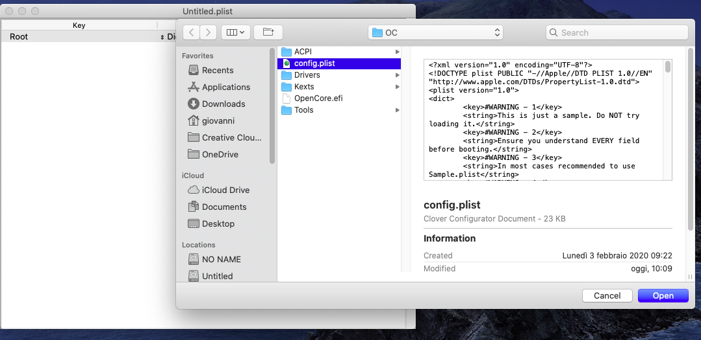
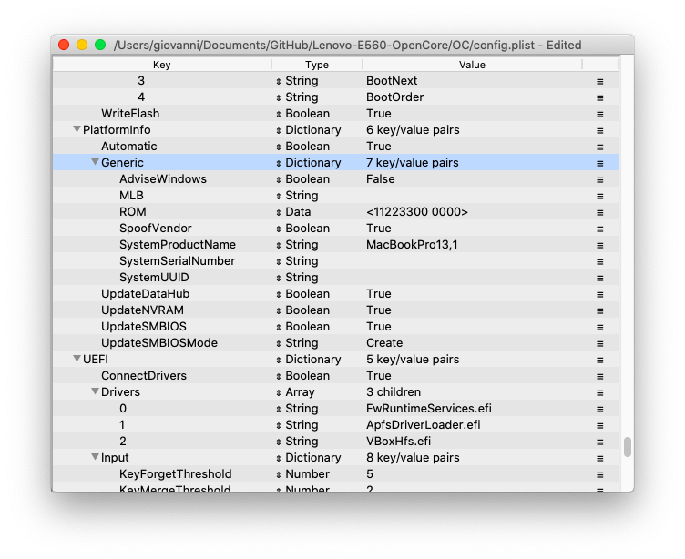
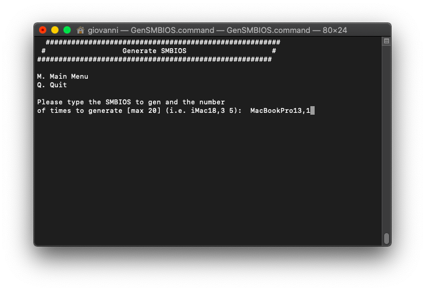
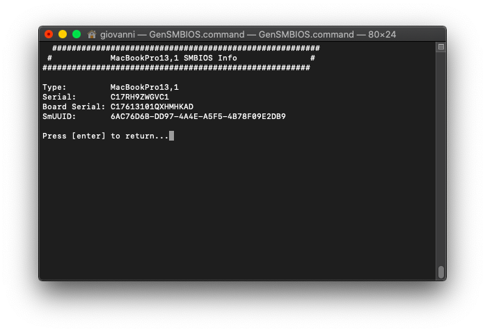
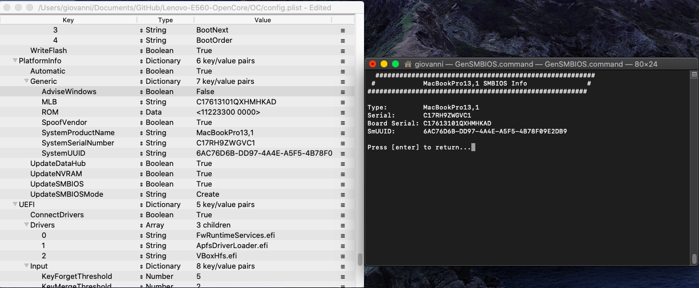

# Lenovo-E560-OpenCore
OpenCore EFI Bootloader for Lenovo Thinkpad E560

Converted from [@rsdev69 's repository](https://github.com/rsdev69/Lenovo-E560-Clover) following the [OpenCore Vanilla Desktop Guide](https://khronokernel-2.gitbook.io/opencore-vanilla-desktop-guide/)

## Instructions
#### 1. Clone this Repository
#### 2. Download CorpNewt's ProperTree to modify config.plist
You can download it from [@corpnewt 's ProperTree repository](https://github.com/corpnewt/ProperTree)
#### 3. Download CorpNewt's GenSMBIOS to generate your SMBIOS
You can download it from [@corpnewt 's GenSMBIOS repository](https://github.com/corpnewt/ProperTree)
#### 4. Launch Propertree
If you are on Windows open Propertree.bat, else if you are on Mac OS or Linux open ProperTree.command. 
***You need to have Python 3 installed on your PC.***
#### 5. With ProperTree open the config.plist inside the OC folder you have cloned from this repository

#### 6. Scroll to PlatformInfo => Generic

#### 7. Launch GenSMBIOS
If you are on Windows open GenSMBIOS.bat, else if you are on Mac OS or Linux open GenSMBIOS.command. 
***You need to have Python 3 installed on your PC.***
#### 8. Generate your SMBIOS
Pick option 1. and press `Enter` for downloading MacSerial and Option 3. and press `Enter` for selecting out SMBIOS. Type `MacBookPro13,1` and press `Enter` 
The `Serial part` gets copied to Generic -> SystemSerialNumber. 
The `Board Serial` part gets copied to Generic -> MLB. 
The `SmUUID` part gets copied to Generic -> SystemUUID. 

Examples:

#### 9. FileVault
This is optional, but if you are transitioning from Clover and you have FileVault activated, follow the steps from the FileVault Section on the [OpenCore Vanilla Desktop Guide](https://khronokernel-2.gitbook.io/opencore-vanilla-desktop-guide/post-install/security#FileVault)

#### 10. Save your config.plist and place the *OC* folder inside the *EFI* folder of your boot volume

## What does it works

<table>
<tr>
  <th>DESCRIPTION</th>
  <th>LENOVO™ THINKPAD® E560</th>
  <th>Work</th>
</tr>
<tr>
  <td>Processor</td>
  <td>Intel® Core™ i5 6200U Processor</td>
  <td>YES</td>
</tr>
<tr>
  <td>Graphics</td>
  <td>Intel HD Graphics 520</td>
  <td>YES</td>
</tr>
<tr>
  <td>Memory</td>
  <td>8192 MB DDR3L-1600, 2 slots</td>
  <td>YES</td>
</tr>
<tr>
  <td>Display</td>
  <td>15.6 inch 16:9, 1920 x 1080 pixel, LP156WF6-SPK2</td>
  <td>YES</td>
</tr>
<tr>
  <td>Storage</td>
  <td>Samsung QVO 1 TB SSD</td>
  <td>YES</td>
</tr>
<tr>
  <td>Wifi</td>
  <td>Tp-link 725n</td>
  <td>YES</td>
</tr>
<tr>
  <td>Bluetooth</td>
  <td>Intel 3165</td>
  <td>YES</td>
</tr>
<tr>
  <td>Speakers</td>
  <td>Conexant HD Audio CX20753/4</td>
  <td>YES</td>
</tr>
<tr>
  <td>USB Ports</td>
  <td>3 x USB 3.0</td>
  <td>YES</td>
</tr>
<tr>
  <td>VGA Port</td>
  <td>Max Full HD 60hz</td>
  <td>YES</td>
</tr>
<tr>
  <td>HDMI 1.4 Ports</td>
  <td>Max 4k 30hz</td>
  <td>YES</td>
</tr>
</table>
